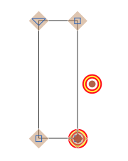

# ShowAnchorsWithDuplicateCoordinates

*View > Show Anchors with Duplicate Coordinates* (de: *Anker mit selben Koordinaten anzeigen*, es: *Mostrar anclas con mismas coordenadas*, fr: *Afficher ancres avec mêmes coordinées*, pt: *Mostrar âncoras com as mesmas coordenadas*) highlights ‘overlapping’ anchors (2+ anchors with the same coordinates).

### Installation

1. One-click install *Show Anchors with Duplicate Coordinates* from *Window > Plugin Manager*
2. Restart Glyphs.

### Usage Instructions

1. Open at least one glyph in Edit View.
2. Use *View > Show Anchors with Duplicate Coordinates* to toggle the highlighting of duplicate anchor coordinates.

### License

Copyright 2019 Rainer Erich Scheichelbauer (@mekkablue).
Based on sample code by Georg Seifert (@schriftgestalt) and Jan Gerner (@yanone).

Licensed under the Apache License, Version 2.0 (the "License");
you may not use this file except in compliance with the License.
You may obtain a copy of the License at

http://www.apache.org/licenses/LICENSE-2.0

See the License file included in this repository for further details.

